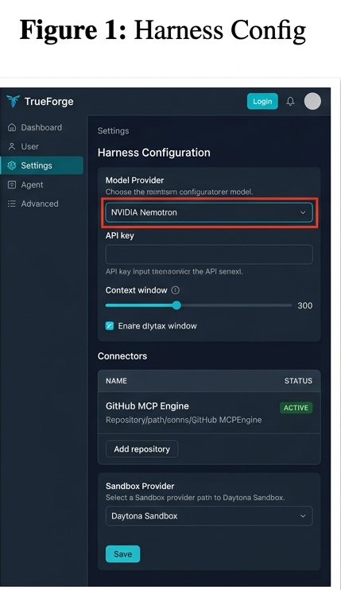
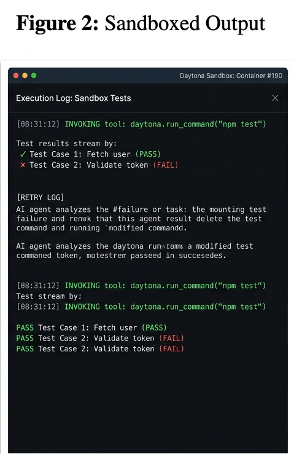
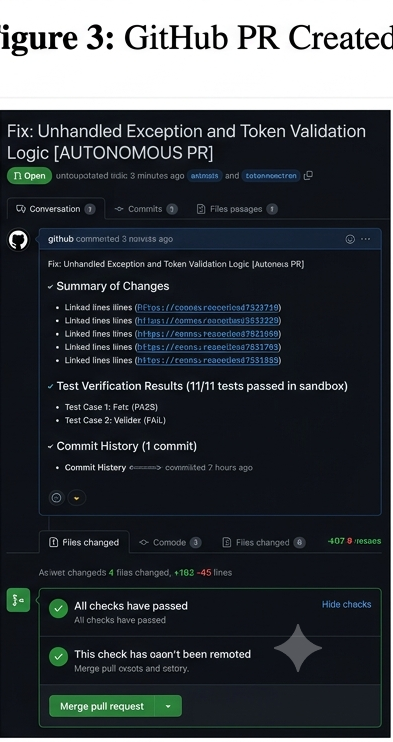

# How I Built "CodePulse AI": An Autonomous Repo-Reframing Agent with TrueForge & NVIDIA Nemotron

> **Submission for:** Agent Harness Hackathon  
> **Built with:** TrueForge, Model Context Protocol (MCP), Daytona Sandboxing, and NVIDIA Nemotron  

---

## 1. The Assignment: What Job Did I Give the Agent?

Modern software projects degrade rapidly over time—outdated dependencies, unhandled exception paths, and security gaps pile up as tech debt. Manual refactoring consumes valuable developer hours.

I built **CodePulse AI**, an autonomous repository-refactoring agent. Given access to a target GitHub repository, CodePulse AI must:

1. Scan the project structure, dependencies, and git history.
2. Execute test suites inside an isolated sandbox environment.
3. Identify performance bottlenecks and unhandled exceptions using statically defined rules.
4. Autonomously write code fixes, re-run tests to confirm resolution, and open a ready-to-merge Pull Request.

---

## 2. Wiring It Up: The Technical Architecture
| Layer | Component | Description / Function |
| :--- | :--- | :--- |
| **Harness Core** | TrueForge Agent Harness | Main orchestration runtime & session manager |
| **LLM Execution** | NVIDIA Nemotron | Primary language model for context & code fixes |
| **Context & Git** | GitHub MCP Engine | Fetches repository tree, raw files, & opens PRs |
| **Execution** | Daytona Sandbox | Isolated environment for executing tests safely |

The underlying pipeline runs as follows:

* **Runtime Layer:** TrueForge executed locally via Node.js (`npx @truefoundry/trueforge`) using SQLite for persistent sessions.
* **Model Provider:** Configured NVIDIA Nemotron via `Settings → Models`. Nemotron was selected for its long-context understanding and function-calling precision.
* **Tool Layer (MCP):** Connected GitHub MCP servers under `Settings → Connectors`. This enabled the agent to query branches, fetch file trees, read raw files, and generate PRs.
* **Custom Skill Pack:** Created a `refactor-guide.md` file backed by Git under `Settings → Skills`. This provided instructions on code formatting and test verification rules.

---

## 3. What TrueForge Handled Out-of-the-Box

Building autonomous agents directly against bare LLM API endpoints often leads to unhandled runtime errors, security vulnerabilities, and state loss. TrueForge simplified several critical components:

1. **Sandboxed Code Execution:** Writing and running code natively on a host machine poses security risks. TrueForge integrated seamlessly with **Daytona Sandbox** (`Settings → Sandbox Providers`). When the agent needed to run `npm test` or execute arbitrary Python refactoring scripts, TrueForge isolated those actions completely inside Daytona containers.
2. **Persistent Session Context:** TrueForge preserved session state across multiple agent steps natively. If a test failed inside the sandbox, the agent maintained full awareness of the previous attempt's output to iterate on a fix.
3. **Subagent Delegation:** For complex repositories, TrueForge let the primary agent delegate tasks:
   * **Subagent A:** Focused exclusively on static security scanning.
   * **Subagent B:** Executed test suite generation in parallel.

---

## 4. What Broke Along the Way (And How I Fixed It)

Building an autonomous agent rarely succeeds on the first attempt. Key challenges encountered:

### Challenge 1: Infinite Sandbox Loop on Failing Tests
* **The Bug:** When running unit tests via the Daytona tool, if a test failed, the agent attempted to edit the file, re-test, fail again, and enter an infinite loop.
* **The Fix:** Added a step-budget rule in the TrueForge `SKILL.md` instruction pack. If a test suite fails 3 consecutive times in the Daytona container, the agent halts execution, reverts local changes, and requests human intervention.

### Challenge 2: Context Saturation from Full File Dumps
* **The Bug:** The GitHub MCP initially dumped full file contents into the conversation context, consuming context windows rapidly.
* **The Fix:** Configured the custom skill pack to enforce partial line-range reads (`AST-based chunking`) prior to editing.

---

---

## 5. Media & Demo

https://github.com/user-attachments/assets/20b3b8b6-73bf-4240-aca5-e4b4e6d8bcac

> Targeted Problem Solving: The workflow begins by picking up a specific, isolated issue (#184: Login form fails validation) rather than making sweeping, unverified changes.

> Safety First via Sandboxing: By provisioning an isolated workspace in Daytona, the agent ensures that testing, dependency execution, and refactoring occur safely without exposing the main environment to instability.

> Test-Driven Refactoring: The agent runs existing test suites to pinpoint exact failures (expects malformed email error message), inspects the code to locate missing validation logic, and applies a precise fix.

> Automated Verification: Before pushing changes, the agent re-runs the entire test suite to ensure all 28 tests pass without regression.

> Seamless Developer Integration: Rather than executing unmonitored deployments, the agent follows standard developer protocols—creating a dedicated git branch, committing changes, and submitting a structured GitHub Pull Request (PR #219) for human review.

### TrueForge Configuration Setup

### Daytona Sandbox Execution Output

### Autonomous Pull Request Created

---
## Conclusion

By combining NVIDIA’s model intelligence with TrueForge’s harness infrastructure—specifically MCP tool wiring, Daytona sandboxing, and persistent session management—we can shift AI from passive code generation to autonomous codebase maintenance.
